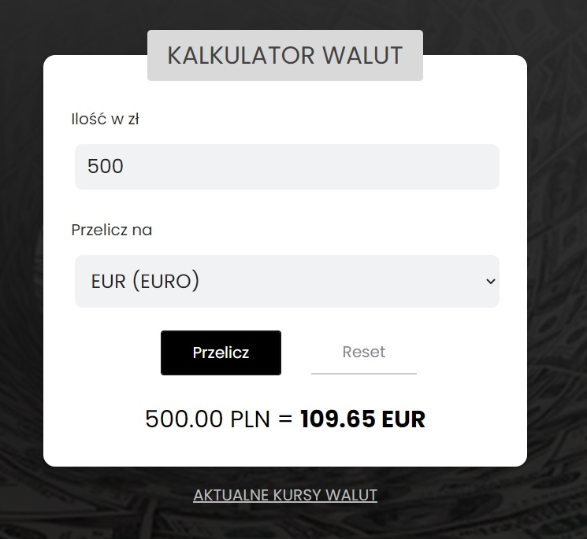

# 🤑 CURRENCY-CONVERTER 🤑

## This is my currency calculator 

## DEMO:

[Link to my currency kalkulator](https://piotrkubiak.github.io/currency-converter/)

You can convert from PLN to:
- Euro
- British Pound
- U.S. Dollar
- Norwegian crown
- Swedish crown
- Frank

### INSTRUCTION:

When you want to convert PLN to e.g. Euro, you have to enter the value of your money in the PLN field, then select the Euro currency and click "Przelicz !!!".

The result will appear in red in the field "Wynik =>"
If you want to re-transfer, click "Resetuj". 

You can also see the current exchange rates by clicking on the bottom "AKTUALNE KURSY WALUT!!!"

### 😀 Thank you for using my currency calculator! 😀